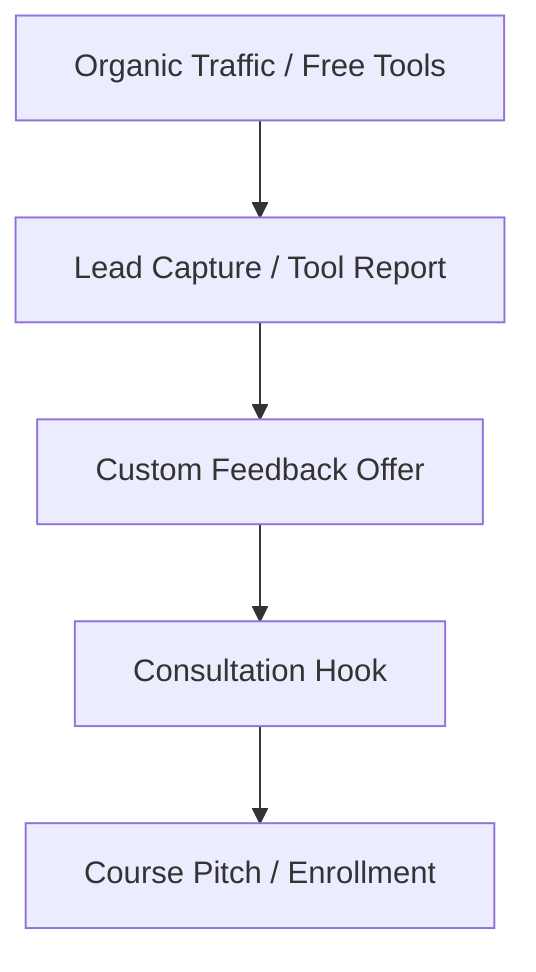

# Free-to-Paid Conversion Funnel SOP

This document outlines the marketing and operational logic to convert free tool users into paid course enrollments.

## Funnel Stages

## Conversion SOP

### 1. Tool Entry
- Students visit free tools (e.g. IELTS Writing Task 2 Generator or IELTS Band Score Calculator).
- The page contains clean input panels.

### 2. Lead Capture
- After completing the typing drill or score calculation:
  - Display the basic score instantly.
  - Offer a **detailed PDF breakdown** or **expert review** by email/WhatsApp in exchange for their name, target band score, and contact details.

### 3. Immediate Follow-up (Trigger 1)
- Within 10 minutes of receiving details:
  - Auto-send the requested report.
  - Include an invitation to schedule a **free 10-minute diagnostic session** to discuss how to overcome the identified weaknesses.

### 4. Expert Pivot (Trigger 2)
- Academic counselor calls the qualified warm lead.
- Highlight the diagnostic gaps and introduce how Fluento's **IELTS Live Batch** (or English Foundation) systematically covers these weaknesses.

### 5. Final Checkout
- Deliver payment links and guide through enrollment.
