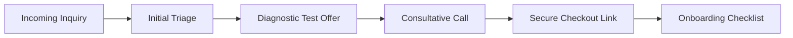

# Sales Process & Lead Conversion: Fluento

This document outlines the standard stages of converting interest into course enrollments.

## Lead Journey Loop

## Step-by-Step Sales Pipeline

### 1. Reception
- Capturing leads from social inboxes and website visits.
- Input data parameters into the CRM database.

### 2. Triage & Diagnostic Offer
- Analyze student requirements.
- Pitch the free diagnostic mock: *"Aapnar details amra payechi. Apnar current preparation level kemon ta check korar jonno amader free mock test-ti diye dekhun..."*

### 3. Counseling Call (SOP Sales Call)
- Educational consultant calls the student.
- Identifies goals, constraints (time, budget), and reviews diagnostic score.
- Explains batch value (live class limits, direct instructor reviews).

### 4. Link Delivery & Checkout
- Send direct Bkash/Nagad checkout links via SMS/WhatsApp.
- Ensure payment receipt is verified automatically in the billing engine.

### 5. Onboarding
- Auto-add enrolled student to LMS, Slack groups, and schedules.
- Guide student on taking their first grammar/listening diagnostic.
