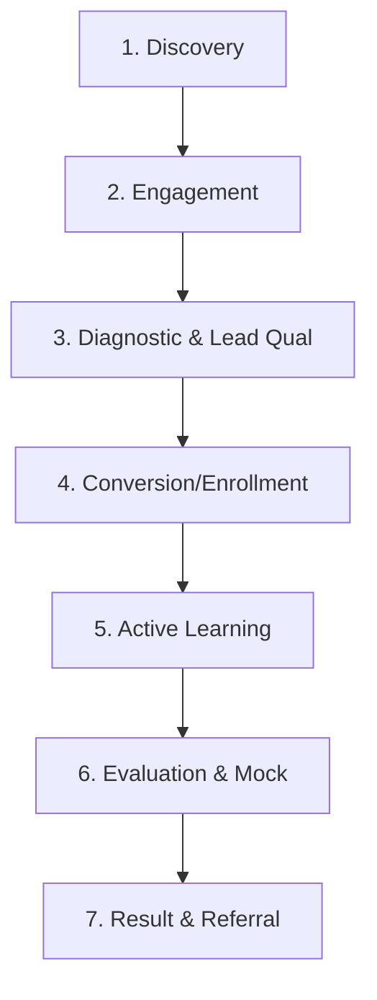

# Student Journey Map: Fluento

This document outlines the lifecycle stages of a student interacting with Fluento.

## Journey Phases

### 1. Discovery (আবিষ্কার)
- **Touchpoint**: YouTube tutorials, Facebook reels, organic search for Writing Task 2 Generator or Band Calculator.
- **Behavior**: Looking for strategies to fix immediate struggles (e.g. speaking flow, vocabulary).

### 2. Engagement (যোগাযোগ)
- **Touchpoint**: Comments on posts, landing page visits, downloading free PDF guides.
- **Behavior**: Interacting with Fluento chatbot/counselors.

### 3. Diagnostic & Lead Qualification (দক্ষতা যাচাই)
- **Touchpoint**: Free vocabulary test or Writing Task 2 trial check.
- **Behavior**: Evaluated on current level. Receives direct, helpful, and honest feedback. Categorized as "Warm" or "Hot".

### 4. Conversion / Enrollment (ভর্তি)
- **Touchpoint**: Receiving standard syllabus, secure checkout links, onboarding call.
- **Behavior**: Enrolls in either Live IELTS Batch, English Foundation, or Guided Self-Study.

### 5. Active Learning (অধ্যয়ন)
- **Touchpoint**: LMS lectures, homework submissions, speaking practice drills.
- **Behavior**: Undergoes rigorous weekly accountability checklist.

### 6. Evaluation & Mock Test (মক টেস্ট ও মূল্যায়ন)
- **Touchpoint**: Full 4-module computer mock exam, writing/speaking reviews.
- **Behavior**: Identifying final weak spots before taking the official exam.

### 7. Results & Referral (সাফল্য ও রেফারেল)
- **Touchpoint**: Official IELTS result submission.
- **Behavior**: Shares testimonial. Recommends Fluento to peer networks.
